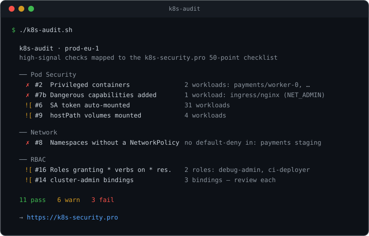

# k8s-audit

**A fast, dependency-light Kubernetes security audit you can run in one command.**

`k8s-audit` runs a set of high-signal security checks against your current cluster
using only `kubectl` + `jq`, and prints a clean report grouped by security domain —
privileged containers, missing NetworkPolicies, over-broad RBAC, `:latest` images,
missing resource limits, and more.

It's read-only, sends nothing anywhere, and needs no install beyond a shell.



## Why this exists

Everything in Kubernetes security is technically "free" — CIS Benchmark, kube-bench,
Kubescape, Trivy. But those tools flag *hundreds* of items and leave you to figure out
which ones matter and how to fix them. `k8s-audit` is the opinionated 30-second first
pass: ~16 checks that catch the most common real-world exposures, each mapped to
a specific item in the [k8s-security.pro 50-point checklist](https://k8s-security.pro).

It's built and maintained by the team behind **[k8s-security.pro](https://k8s-security.pro)** —
a production hardening kit (50-point audit, 25 YAML templates, Helm chart, Kustomize
overlays, CIS & SOC2 mappings). This repo is the free, open-source front door to it.

## Install

No install required — just clone and run:

```bash
git clone https://github.com/k8s-security-pro/k8s-audit.git
cd k8s-audit
./k8s-audit.sh
```

Requirements: `kubectl` (pointed at your cluster) and `jq`.

## Usage

```bash
./k8s-audit.sh                 # audit all namespaces
./k8s-audit.sh -n payments     # a single namespace
./k8s-audit.sh --json          # machine-readable output (for CI / dashboards)
```

Exit code is non-zero if any **FAIL**-severity check trips — so you can gate CI on it.

## Use it in CI

Drop this into `.github/workflows/k8s-security-audit.yml` to fail a PR that introduces
a privileged container or an unprotected namespace (full example in
[`.github/workflows/`](.github/workflows/k8s-security-audit.yml)):

```yaml
- name: Kubernetes security audit
  run: |
    curl -sSL https://raw.githubusercontent.com/k8s-security-pro/k8s-audit/main/k8s-audit.sh -o k8s-audit.sh
    chmod +x k8s-audit.sh
    ./k8s-audit.sh
```

## What it checks (16 of 50)

| # | Domain | Check |
|---|--------|-------|
| 2 | Pod Security | Privileged containers |
| 3 | Pod Security | `allowPrivilegeEscalation` not disabled |
| 4 | Pod Security | Running as root (`runAsNonRoot` unset) |
| 4b | Pod Security | `readOnlyRootFilesystem` not set |
| 5 | Pod Security | `hostNetwork` / `hostPID` / `hostIPC` |
| 6 | Pod Security | ServiceAccount token auto-mounted |
| 7 | Pod Security | Capabilities not dropped (`ALL`) |
| 7b | Pod Security | Dangerous capabilities added (`SYS_ADMIN`, `NET_ADMIN`, …) |
| 9 | Pod Security | `hostPath` volumes mounted |
| 8 | Network | Namespaces without a NetworkPolicy (no default-deny) |
| 14 | RBAC | `cluster-admin` bindings |
| 15 | RBAC | Workloads using the `default` ServiceAccount |
| 16 | RBAC | Roles granting `*` verbs on `*` resources |
| 20 | Cluster Hardening | Workloads in the `default` namespace |
| 22 | Cluster Hardening | Containers without resource limits |
| 28 | Supply Chain | Images using `:latest` or untagged |

## Going deeper

`k8s-audit` deliberately stops at the high-signal dozen. For the complete picture:

- **The full 50-point audit + copy-paste remediation YAML, Helm chart, Kustomize
  overlays, and CIS/SOC2 compliance mappings → [k8s-security.pro](https://k8s-security.pro)**
- Deeper CIS/NSA scanning → [kube-bench](https://github.com/aquasecurity/kube-bench),
  [Kubescape](https://github.com/kubescape/kubescape), [Trivy](https://github.com/aquasecurity/trivy)
  (if these are on your `PATH`, `k8s-audit` points you at the right command).

## Contributing

Issues and PRs welcome — especially new high-signal checks (keep them `kubectl`+`jq`
only, read-only, and mapped to a checklist domain). New to the project? Look for the
[`good first issue`](https://github.com/k8s-security-pro/k8s-audit/issues?q=is%3Aissue+is%3Aopen+label%3A%22good+first+issue%22)
label — each one is a small, self-contained check with the jq filter sketched out for you.
See [CONTRIBUTING.md](CONTRIBUTING.md) for how a check is structured.

## License

MIT © [k8s-security.pro](https://k8s-security.pro)
